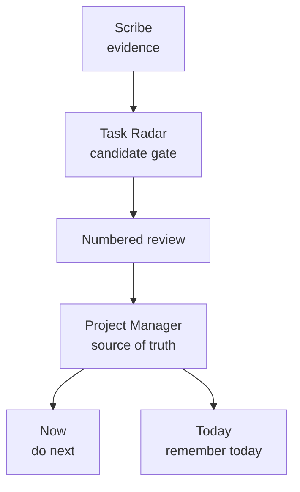

# ManagedFolders 2.2

Date: 2026-06-17

ManagedFolders 2.2 standardizes the task system.

## What Changed

- Task Radar is a normally-empty approval gate, not a backlog.
- Communication records can trigger Task Radar review.
- Meeting/video records can include raw transcript evidence for task extraction.
- Task Radar presents numbered candidates for approval, correction, deletion, deferral, or routing.
- Project Manager is the source of truth for approved managed work.
- Now and Today are small visible execution surfaces, not replacement task stores.
- Todoist-backed Now and Today should link back to Project Manager when used for managed work.
- "What should I work on now?" is an Executive work-selection trigger.

## Task System Shape

## Notes

This public note is a sanitized summary. Private implementation details, client data, local registry rows, and operational logs are not included in the public mirror.

